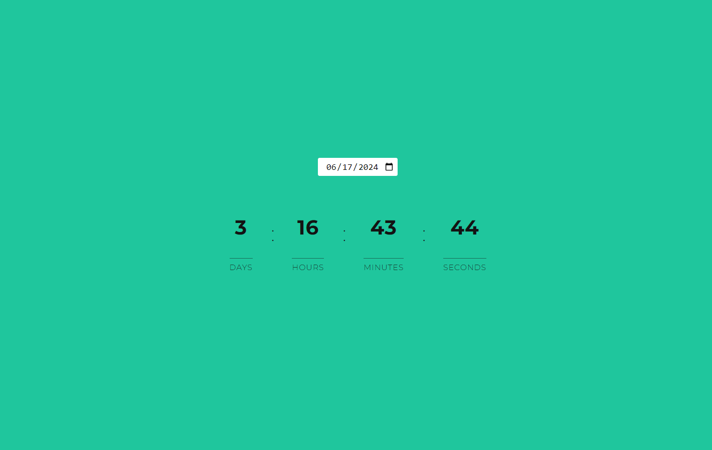

# :closed_book: TASK #3 Count-Down Timer 

### _as an internee at CognoRiseInfotech !!_

### Link :link: https://cognorise-countdown-timer.netlify.app/

## Interface

## Run Locally

  - Run This command `https://github.com/developer-rak/CognoRise_CountDown-Timer.git`
  - You are now in the dev environment and you can play around

## ✨ Features

  - Remaining time to New Year
  - Select Date for CountDown
  - Days, Hours, Minutes, Seconds
  - Open Source (Tweak it and use it)

## ⚙️ Tech Stack
  - HTML5
  - CSS
  - JAVASCRIPT
  - Netlify
